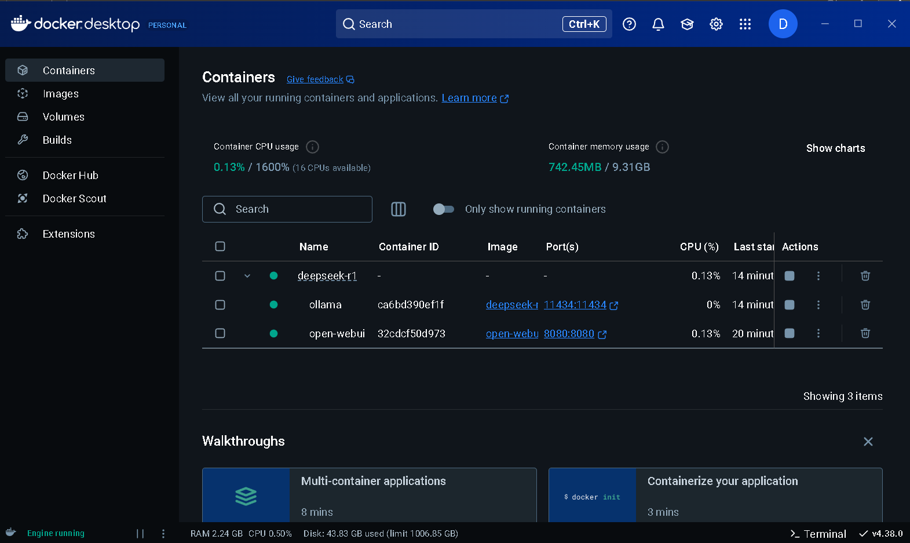
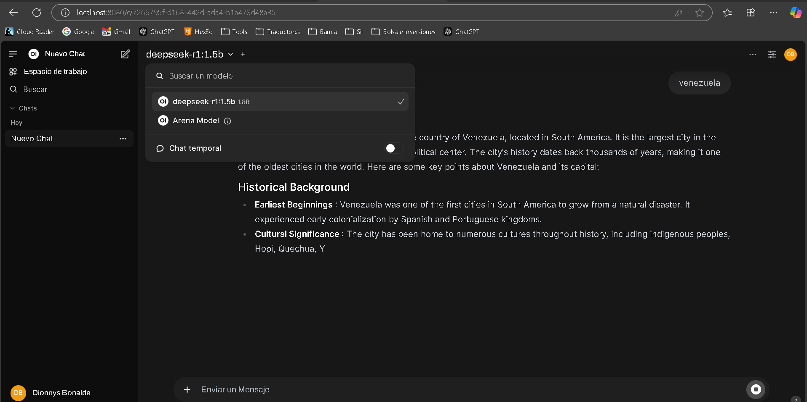

# Ollama Docker

Este repositorio contiene un Dockerfile y una configuración con **docker-compose** para ejecutar **Ollama** en un contenedor basado en **Ubuntu 20.04**. Se incluyen modelos preinstalados y un servicio de interfaz web con **Open WebUI**.

## Características
- Imagen base: **Ubuntu 20.04**
- Instalación automática de dependencias
- Descarga de modelos predefinidos
- Servicio de interfaz web con **Open WebUI**
- Uso de volúmenes para persistencia de datos
- Exposición de los puertos necesarios

## Requisitos
- [Docker](https://docs.docker.com/get-docker/)
- [Docker Compose](https://docs.docker.com/compose/install/)

## Construcción y Ejecución del Contenedor
Ejecuta el siguiente comando para construir y levantar los servicios:

```sh
docker-compose up -d --build
```

Esto iniciará los siguientes servicios:
- **Ollama** en el puerto `11434`
- **Open WebUI** en el puerto `8080`

### Vista de Docker Desktop


## Verificación de Modelos
Para verificar los modelos descargados dentro del contenedor, ejecuta:

```sh
docker exec -it ollama ollama list
```

## Descarga manual de modelos
Si deseas agregar modelos adicionales, puedes ejecutar:

```sh
docker exec -it ollama ollama pull <modelo>
```
Por ejemplo:
```sh
docker exec -it ollama ollama pull llama2:7b
```

### Interfaz Web de Open WebUI


## Estructura del Proyecto
```
/
├── Dockerfile
├── entrypoint.sh
├── docker-compose.yml
├── README.md
```

## Notas
- **Los modelos se descargan dinámicamente al iniciar el contenedor**, asegurando que `ollama serve` esté en ejecución antes de `ollama pull`.
- Para mantener los modelos entre reinicios, se utiliza un volumen en `/root/.ollama`.

```sh
docker-compose up -d
```

## Contribución
Si deseas contribuir, abre un **Pull Request** con tus mejoras o reporta problemas en la sección de **Issues**.

## Licencia
Este proyecto se encuentra bajo la licencia **MIT**.
